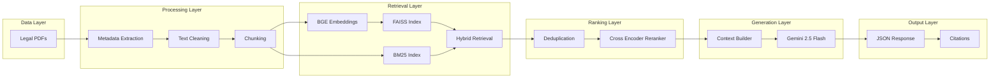

# Hybrid Legal Retrieval-Augmented Generation System

This project is a production-oriented Hybrid Retrieval-Augmented Generation (RAG) system designed for legal document understanding and question answering.

The system combines semantic vector search, keyword-based retrieval, cross-encoder reranking, metadata-aware source tracking, and Large Language Model (LLM) generation to provide accurate, context-grounded responses from legal documents.

Unlike traditional chatbot implementations that rely solely on vector similarity search, this system utilizes a hybrid retrieval architecture that combines FAISS-based dense retrieval with BM25 sparse retrieval, significantly improving recall and retrieval quality for legal queries involving section numbers, legal terminology, and statutory references.

The retrieved documents are reranked using a Cross-Encoder model before being passed to Gemini 2.5 Flash for response generation. Every response includes source metadata and page-level citations, improving transparency and trustworthiness.

This project demonstrates practical implementation of modern RAG engineering techniques including hybrid retrieval, reranking, metadata enrichment, citation generation, prompt safety, and structured response generation.

# Architecture Section



## Features

- Hybrid Retrieval (BM25 + Dense Retrieval)
- BGE Large Embeddings
- FAISS Vector Search
- BM25 Keyword Search
- Cross Encoder Reranking
- Metadata-Aware Retrieval
- Source Attribution
- Page-Level Citations
- Prompt Injection Detection
- Gemini 2.5 Flash Integration
- Structured JSON Responses
- Legal Domain Knowledge Retrieval

## Tech Stack

### Retrieval
- FAISS
- BM25 Retriever
- LangChain

### Embeddings
- BAAI/bge-large-en-v1.5

### Reranking
- BAAI/bge-reranker-base

### LLM
- Google Gemini 2.5 Flash

### Data Processing
- PyPDFLoader
- RecursiveCharacterTextSplitter

### Development Environment
- Python
- Google Colab

## Example Output

```json
{
  "answer": "Murder is punishable under Section 103 of the Bharatiya Nyaya Sanhita.",
  "citations": [
    {
      "source": "BNS.pdf",
      "law": "Bharatiya Nyaya Sanhita",
      "page": 245
    }
  ]
}
```
